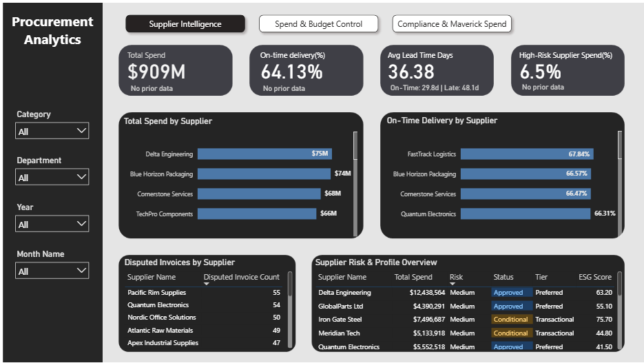
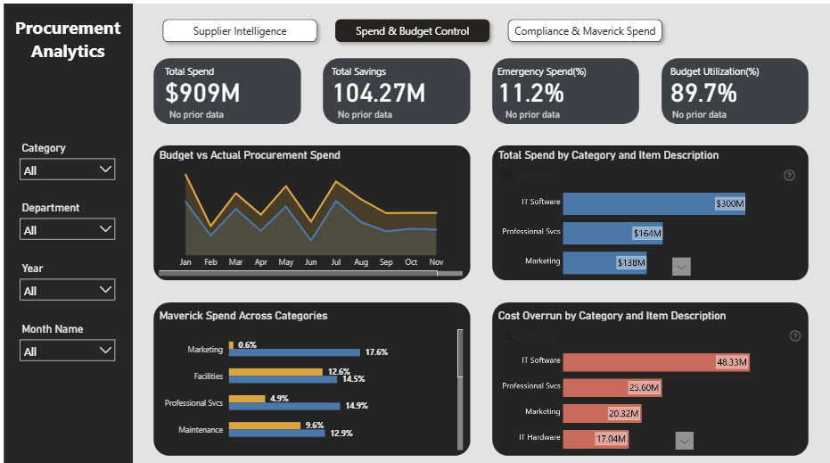
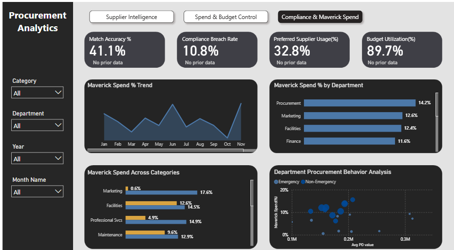

# 📦 Procurement Analytics Dashboard

> **"Having data is easy. Turning it into procurement decisions that save money and improve efficiency — that's where the real challenge begins."**

---

## 📌 Project Overview

This project is a **end-to-end Procurement Analytics Dashboard** built in **Power BI**, designed to help organizations reduce costs, improve supplier performance, and enforce procurement compliance.

Rather than jumping straight into building visuals, the project started with one key question:

> **"How can I help reduce costs and save money for the company?"**

This question shaped every metric tracked, every visual built, and every insight surfaced.

---

## 🖥️ Dashboard Pages

| Page | Description |
|------|-------------|
| 📊 **Supplier Intelligence** | Supplier spend, on-time delivery, disputed invoices, and risk profiling |
| 💰 **Spend & Budget Control** | Budget vs actual spend, category-wise spend, cost overruns, maverick spend |
| ✅ **Compliance & Maverick Spend** | Match accuracy, compliance breach rate, department behavior analysis |

---

## 📸 Dashboard Screenshots

### 1. Supplier Intelligence

### 2. Spend & Budget Control

### 3. Compliance & Maverick Spend

---

## 🔍 Key Insights

- 🔴 **6.5%** of total spend is going to **High-Risk Suppliers** — a major financial vulnerability
- 💰 **Delta Engineering** tops supplier spend at **$75M**, warranting contract renegotiation
- 🚚 **No supplier crossed 80% On-Time Delivery** — FastTrack Logistics leads at just **67.84%**
- 💻 **IT Software** is the largest category at **$300M** with **$48.33M** in cost overruns
- ⚠️ **Procurement department leads in Maverick Spend at 14.2%** — the cost-control team is bypassing preferred suppliers the most
- 📋 **Pacific Rim Supplies** has the highest disputed invoice count at **55**

---

## 📊 KPIs Tracked

| KPI | Value |
|-----|-------|
| Total Spend | $909M |
| Total Savings | $104.27M |
| On-Time Delivery Rate | 64.13% |
| Avg Lead Time (Days) | 36.38 |
| High-Risk Supplier Spend | 6.5% |
| Emergency Spend | 11.2% |
| Budget Utilization | 89.7% |
| Compliance Breach Rate | 10.8% |
| Preferred Supplier Usage | 32.8% |
| Match Accuracy | 41.1% |

---

## 🛠️ Tools & Technologies

- **Power BI** — Dashboard design and data visualization
- **Microsoft Excel / CSV** — Data source and preprocessing
- **DAX** — Custom measures and KPIs
- **Power Query** — Data transformation and cleaning

---

## 💡 What I Learned

- Asking the **right business question** before building anything leads to more impactful dashboards
- **Maverick spend** is often a people and awareness problem, not just a policy problem
- Procurement data can reveal **hidden risks** that aren't obvious without proper visualization
- Structuring a dashboard into **clear analytical pages** improves decision-making flow

---

## 🤝 Connect with Me

If you found this project useful or have feedback, feel free to connect:

- 💼 [LinkedIn](https://www.linkedin.com/in/manavgulati12)
- 📧 gulatimanav00@gmail.com

---

⭐ **If you found this project helpful, please give it a star!**

---

*#ProcurementAnalytics #PowerBI #DataAnalytics #SupplyChain #BusinessIntelligence*
